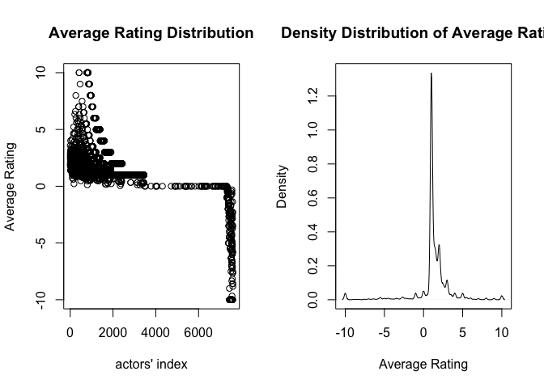
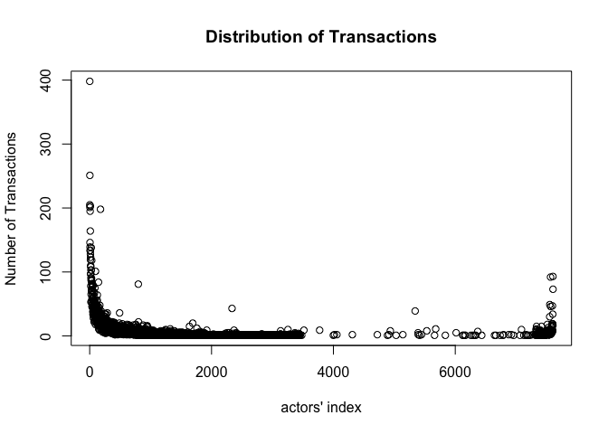
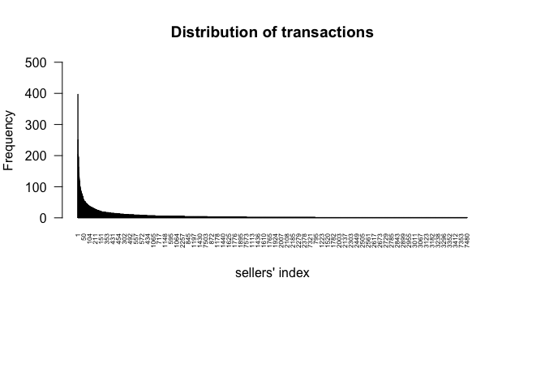
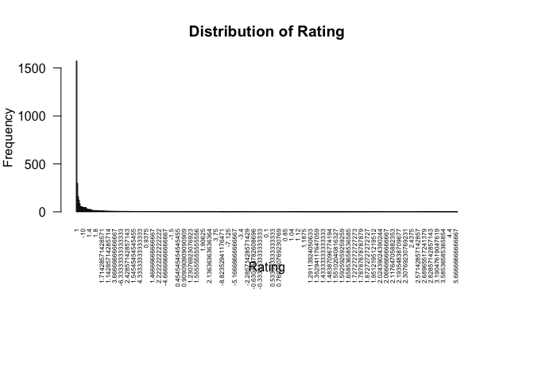
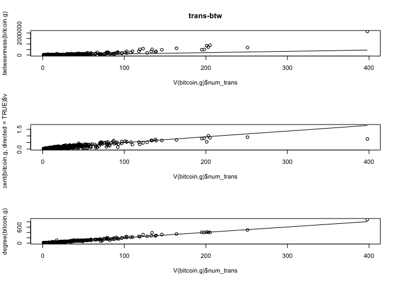
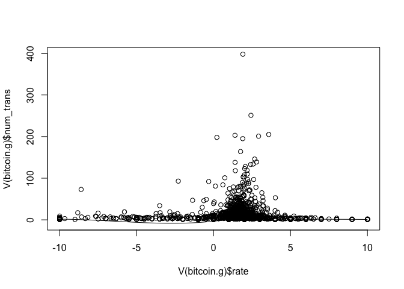
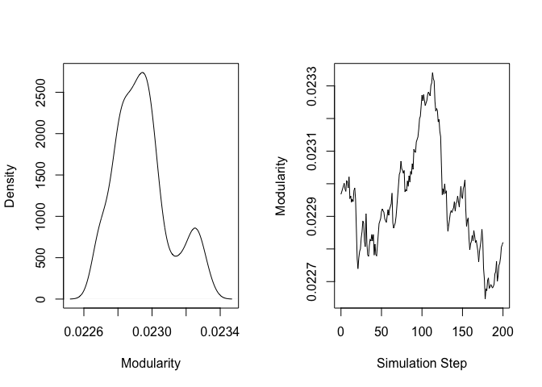

# Intro/background/research question:

How does seller rating impact how interconnected a seller is in the
bitcoin market? How do the ratings affect the transactions in a
who-trust-who bitcoin market?

Since cryptocurrencies like bitcoin are anonymous, it is important that
there is trust when a transaction is made. Today bitcoin transactions
can be completed through outside sources such as Coinbase or Robinhood
but when it first started out people would earn bitcoin by mining it
which is where they would remotely lease out their computing power in
exchange for some of this currency. People could then sell coins in
exchange for US dollars on online exchange sites like Bitcoin-Alpha
which is where our data came from. Once the transaction goes through
Bitcoin-Alpha allows buyers to rate the seller from a scale of -10 to
10, with -10 being the least satisfactory or most untrustworthy, 10
being the most satisfactory/trustworthy, and 0 being neutral. This
system works similar to Uber, Esty’s, or Ebay’s rating systems, just
with a different value range. Our data has 24,296 transactions involving
3,783 people. This network is directed since only the buyer gives the
seller a rating, not like Uber where both parties give each other a
rating.

The main questions we want to answer is how does this seller rating
impact how interconnected the seller is in the bitcoin market. How
correlated is this rating to how many transactions a seller makes and
who the seller sells to in a who-trust-who bitcoin market. If this has
similar trends to other peer-to-peer markets, the rating would be
extremely important. For example when buying from an unknown seller on
Ebay or Amazon, the websites provide information like how many sales the
seller has as well as an average rating for all of their sales.
Typically one would not buy something from someone with a low rating
particularly if returns are not possible. Something to consider here is
Bitcoin is not a physical object, it is entirely digital, meaning then
every one is theoretically identical. This means that rating may be less
important. However, crypto-currencies are entirely unregulated allowing
for more illegal activity to take place. The entire purpose of them is
to have an untraceable currency that isn’t regulated or attached to any
country. This means everyone is anonymous. This would make it more risky
to make a transaction with an unknown seller which could result in
rating having an increased importance.

We are going to analyze this data to see if there are any trends.
Crypto-currency is still very new so it will be interesting to see if
there are any similarities between its markets and other online
marketplaces in which we are more familiar with them. This is just the
bitcoin market for one bitcoin exchange but it can still give us a lot
of insight into the network and how different actors behave.

# Methodology:

We used the igraph package in R studio to complete our analysis and
generate our visualizations with the help of RColorBrewer package for
color pallets that were accessible. We did not have to clean our data
but we did have to make sure it was not being read with row or column
titles. We started analyzing our data by converting it to a network
object so we could plot our network and generate summary statistics.
After getting a general picture of this network, we explore further into
how attributes like number of transactions and average ratings affect
the structure of the network and further understanding of trust networks
by plotting density/frequency distribution, fitting into power-law model
and linear regression model in analyzing hypothesized variables; In the
end, we also predicted how the trust network will be by applying
simulation of social selection principles.

# Code Snippets

## prepare the packages

Figure out which of these packages is already installed

``` r
# Store all installed packages
ya_installed <- library()$results[,1]

# Check whether required packages are already installed and grab only those that still need installation
need_install<-my_packages[!(my_packages %in% ya_installed)]

#install required packages
lapply(need_install, install.packages, character.only = TRUE)
```

    ## list()

Now, load only unloaded packages

``` r
# Store all installed packages
ya_loaded <- (.packages())

# Check whether required packages are already installed and grab only those that still need installation
need_load<-my_packages[!(my_packages %in% ya_loaded)]

# Load required packages
lapply(need_load, require, character.only = TRUE)
```

    ## Loading required package: igraph

    ## 
    ## Attaching package: 'igraph'

    ## The following objects are masked from 'package:stats':
    ## 
    ##     decompose, spectrum

    ## The following object is masked from 'package:base':
    ## 
    ##     union

    ## Loading required package: RColorBrewer

    ## Loading required package: ggplot2

    ## [[1]]
    ## [1] TRUE
    ## 
    ## [[2]]
    ## [1] TRUE
    ## 
    ## [[3]]
    ## [1] TRUE

## Load the csv file

``` r
bitcoin_df<- read.csv("soc-sign-bitcoinalpha.csv", header = FALSE)
View(bitcoin_df)
```

## Generating network object of trust network in bitcoin market

We generate the graph object from the dataframe which is already in the
edgelist form. And since the rating has directions, therefore our graph
is a directed graph. After generating the graph, from the summary, we
know that there are 3783 and 24186 directed edges in total.

``` r
# Create a network graph object
bitcoin.g <- graph_from_data_frame(bitcoin_df[,1:2], directed = TRUE)
# use summary to check it out
summary(bitcoin.g)
```

    ## IGRAPH 649ffc7 DN-- 3783 24186 -- 
    ## + attr: name (v/c)

## Five number summary

Firstly,we can use the “five-number summary” to have a first look into
the

``` r
#Five number summary
##1. Size
gorder(bitcoin.g)
```

    ## [1] 3783

``` r
##2. Density
edge_density(bitcoin.g)
```

    ## [1] 0.001690465

``` r
##3. components
components(bitcoin.g)
```

    ## $membership
    ## 7188  430 3134 3026 3010  804  160   95  377  888   89 1901  161  256  351 3329 
    ##    1    1    1    1    1    1    1    1    1    1    1    1    1    1    1    1 
    ## 3341  649 1583   87   37  309  821 1496  637  964  594 2249  554   20 2227 1315 
    ##    1    1    1    1    1    1    1    1    1    1    1    1    1    1    1    1 
    ##  519 1316 2149 1724   18   57  118 3254 1177  112   11  586   35   15 1445  152 
    ##    1    1    1    1    1    1    1    1    1    1    1    1    1    1    1    1 
    ##    2  113   44 2401   10 2378  126 3245  783  493 1358 1180  529  333 1538 2282 
    ##    1    1    1    1    1    1    1    1    1    1    1    1    1    1    1    1 
    ## 1519 2966  474  330  958   17 1295   38 1952  223  625 1392 3355 1881   58   96 
    ##    1    1    1    1    1    1    1    1    1    1    1    1    1    1    1    1 
    ## 1580  196  146  416 1198 3319 1867  896  617 3300 1877  462 3279  454 1860  121 
    ##    1    1    1    1    1    1    1    1    1    1    1    1    1    1    1    1 
    ##  151 1570 1573 1063 1353  459 2334 1267 1060 1061 7431 1355   71 3070 2113 3001 
    ##    1    1    1    1    1    1    1    1    1    1    1    1    1    1    1    1 
    ##  396 2260  142 2238  123 2942 1509 7410 1760 2876  259 1493 2845  370 2844 2167 
    ##    1    1    1    1    1    1    1    1    1    1    1    1    1    1    1    1 
    ##  156 2808  255  736 7603  346    9   75  175 2754   22  155 1261 2552 2586  710 
    ##    1    1    1    1    1    1    1    1    1    1    1    1    1    1    1    1 
    ##  578  472 2472 1606    4  563  744 3422  250  249 2427 3414 1590 2305 1900 3392 
    ##    1    1    1    1    1    1    1    1    1    1    1    1    1    1    1    1 
    ## 1065 1147 1072 3375 1024  709 1382 3332 1885 3330 1197 3316 1886  154 1522 2391 
    ##    1    1    1    1    1    1    1    1    1    1    1    1    1    1    1    1 
    ## 3298  432 3292 3290 7597 3274 1875  291  158 1579 1846 1066  290 3233  891  247 
    ##    1    1    1    1    1    1    1    1    1    1    1    1    1    1    1    1 
    ## 1856 3211  115 1365  483 3210 3189 3193 2352 1847 3173 1051 1843 2342 7341 3139 
    ##    1    1    1    1    1    1    1    1    1    1    1    1    1    1    1    1 
    ## 1186 3167 3149 1842 3156 3141  817 1840 1839 2324 3143 3142  174 2315 1356 1835 
    ##    1    1    1    1    1    1    1    1    1    1    1    1    1    1    1    1 
    ##  296 3118 1542 3111  753 3088  395 3068 3042 1442 1339  596 2281  222  194 3064 
    ##    1    1    1    1    1    1    1    1    1    1    1    1    1    1    1    1 
    ## 1812 1796  701  124 3057 7427 2276 2271 1525 2235 3027 2090 1342  331 3023 2261 
    ##    1    1    1    1    1    1    1    1    1    1    1    1    1    1    1    1 
    ##   68  116 1043 3020  491  179 2252  214  439 2147 1167  697   67 1793  258 1340 
    ##    1    1    1    1    1    1    1    1    1    1    1    1    1    1    1    1 
    ## 2996 1520 1336   30  178  747 2962 2952  455  260  623   29 1510 2927  301 2907 
    ##    1    1    1    1    1    1    1    1    1    1    1    1    1    1    1    1 
    ## 2909 1148  955 1502 2853 1500 2178 1320  874 2177 2892  636 1034 1494  276 1318 
    ##    1    1    1    1    1    1    1    1    1    1    1    1    1    1    1    1 
    ##  117 1492 1302 1313 1491 2870 2181 1309 1750 2848 1458  951 1029 2176 2846  347 
    ##    1    1    1    1    1    1    1    1    1    1    1    1    1    1    1    1 
    ## 2173 2826 1742 2166 2823 2820 2814 1736 1025 1482 1483 2152 2806 1128 2801 2795 
    ##    1    1    1    1    1    1    1    1    1    1    1    1    1    1    1    1 
    ## 1290 1288 1436 2498 2784  587 2780 2779  305  944 2129  683   42 1136 1283 2127 
    ##    1    1    1    1    1    1    1    1    1    1    1    1    1    1    1    1 
    ## 2093 1284   72  264 2756 1285  613  304 1282 4721 1475 2746 1715  734 2108 1923 
    ##    1    1    1    1    1    1    1    1    1    1    1    1    1    1    1    1 
    ## 1465 2742 2117 1720   90 2731 1457 2725 2109  543 2102  712  231 2687 1708 1129 
    ##    1    1    1    1    1    1    1    1    1    1    1    1    1    1    1    1 
    ##   76 2065 1251 1248  725 2559  507 1942 1232  534  994  503 2448  846    1 1368 
    ##    1    1    1    1    1    1    1    1    1    1    1    1    1    1    1    1 
    ##  164  244   62 2244  148 7403   52  159   66   60  585   97 2006 1421  353   51 
    ##    1    1    1    1    1    1    1    1    1    1    1    1    1    1    1    1 
    ##  185  312  168  354  108   91   40  271  119   54  375  177   31   47   23   74 
    ##    1    1    1    1    1    1    1    1    1    1    1    1    1    1    1    1 
    ##  165  306    8  242  412  381  561  216  107  681   79  272   39  150  181  109 
    ##    1    1    1    1    1    1    1    1    1    1    1    1    1    1    1    1 
    ## 2404   24   19    7  348  473 1921   99 1380   73   85  189  787  133 1709  658 
    ##    1    1    1    1    1    1    1    1    1    1    1    1    1    1    1    1 
    ##  293  768   45  471 1632  281  269 2336  206  241  190 7577  798  211  140  217 
    ##    1    1    1    1    1    1    1    1    1    1    1    1    1    1    1    1 
    ##  182  236  777 1098  106  237 1401 1409  769 1209  917  114 2698 1127 1009 1386 
    ##    1    1    1    1    1    1    1    1    1    1    1    1    1    1    1    1 
    ##  173   43  647    5 1156  553  170   93  145 1523  350   77 1785  166  489   25 
    ##    1    1    1    1    1    1    1    1    1    1    1    1    1    1    1    1 
    ##   83  277   70 1487  270  871  389  544 2631  672  137  424   65 1693  475  449 
    ##    1    1    1    1    1    1    1    1    1    1    1    1    1    1    1    1 
    ## 1998 1977  915   63 1957 1635  508 2499 2497  299 1225  238 2488 1936  382  355 
    ##    1    1    1    1    1    1    1    1    1    1    1    1    1    1    1    1 
    ## 1090 1222   21  564 2459  774  209 1922  504  987 2446  986 1603  379  446  436 
    ##    1    1    1    1    1    1    1    1    1    1    1    1    1    1    1    1 
    ##  512  971   92 7336 1545  103  207    6 7380  287  754   26   34  525  545   56 
    ##    1    1    1    1    1    1    1    1    1    1    1    1    1    1    1    1 
    ## 1849  557  208 1558 2346  974  262 2001  815  120  492 1175   32  172 1347 1338 
    ##    1    1    1    1    1    1    1    1    1    1    1    1    1    1    1    1 
    ##  105  818  890 1362 1547 1056 2280  879   36  590 3260 1174 3198  460 3200  589 
    ##    1    1    1    1    1    1    1    1    1    1    1    1    1    1    1    1 
    ##  433   81 7509  973 1555 3154 7595 1361 2331  509  969  197  621 1036 1054 1818 
    ##    1    1    1    1    1    1    1    1    1    1    1    1    1    1    1    1 
    ##  358  748   13   88  163 1576 2353 3221  136 1367 7512  757   49  646 2328 1360 
    ##    1    1    1    1    1    1    1    1    1    1    1    1    1    1    1    1 
    ## 7377 2321  125 1548 1837 1834  703 1456 7406 1832 3105  641  320  885  632 2300 
    ##    1    1    1    1    1    1    1    1    1    1    1    1    1    1    1    1 
    ##  702  228  752 2291  656  877 2293  650 3328  720 1379  219 3275  345  336  295 
    ##    1    1    1    1    1    1    1    1    1    1    1    1    1    1    1    1 
    ## 1375  435 7390   12 1853 1184 1064 1560  988  203  976  289 7394 3203 1844 2053 
    ##    1    1    1    1    1    1    1    1    1    1    1    1    1    1    1    1 
    ## 1363 3181  288 2263  111 3132 1059 2332  691 1550  286  205 1359 1459  135 7432 
    ##    1    1    1    1    1    1    1    1    1    1    1    1    1    1    1    1 
    ## 1815 3127 1836  266 2311 2308   27  755 2306 5679 1790  937  100   53 2298 3087 
    ##    1    1    1    1    1    1    1    1    1    1    1    1    1    1    1    1 
    ## 1274  227 1348 2295  394 3043 2285 1536  883  199 2290 1816 1524 1169  749  876 
    ##    1    1    1    1    1    1    1    1    1    1    1    1    1    1    1    1 
    ##   33    3  215  479  302  131  859  437 1398  423  510  420  224 7582   16  311 
    ##    1    1    1    1    1    1    1    1    1    1    1    1    1    1    1    1 
    ##  562 1230 1239  567  139  466 1085  771 1270 1264 3774 1003  367 1107  661  274 
    ##    1    1    1    1    1    1    1    1    1    1    1    1    1    1    1    1 
    ##  654  910 1091   84  531  501  583 1702 3356  733  356 1678 1010 7596  781 2017 
    ##    1    1    1    1    1    1    1    1    1    1    1    1    1    1    1    1 
    ## 2002  572  202  664 1636  326  341  538 1233 2492  536 1621 1415  323 1611  609 
    ##    1    1    1    1    1    1    1    1    1    1    1    1    1    1    1    1 
    ##  366  848 1602  365  419  841  468  193 2103 2405  411  807 1038  265 2201  361 
    ##    1    1    1    1    1    1    1    1    1    1    1    1    1    1    1    1 
    ## 1737 1139  386  727 1108 1642 1109  918 2511  570  716  313  718 1615 1218 1086 
    ##    1    1    1    1    1    1    1    1    1    1    1    1    1    1    1    1 
    ## 2485 7569 1088  535 2467 2468 2465  401  772 2454  773  711 7550  842  153 2442 
    ##    1    1    1    1    1    1    1    1    1    1    1    1    1    1    1    1 
    ##  840 2439 1908  251 1087 1909  532  603  191  248  372  982 1372  335 1192  893 
    ##    1    1    1    1    1    1    1    1    1    1    1    1    1    1    1    1 
    ##   59  904  349   61  826  122 1872  391 1068 7591   82 3307 3206  434  597  684 
    ##    1    1    1    1    1    1    1    1    1    1    1    1    1    1    1    1 
    ##  801 1373  110 7126 1535  528  198 3336  602 2395  599  245 1819 3309  310  695 
    ##    1    1    1    1    1    1    1    1    1    1    1    1    1    1    1    1 
    ##  280 3009 2386  484 2354 1194 2333  825  292 1378 1868 1854 1376  692 7444 1859 
    ##    1    1    1    1    1    1    1    1    1    1    1    1    1    1    1    1 
    ## 3236 2363 3231 2320  706 2335  141 7531 3305  524  809 1057 1541 1371 1571 1185 
    ##    1    1    1    1    1    1    1    1    1    1    1    1    1    1    1    1 
    ## 1566  810 1350  549  526  431 1546 1461  458 1374 7420 2376 3222 3158 2326  728 
    ##    1    1    1    1    1    1    1    1    1    1    1    1    1    1    1    1 
    ##  278 1830 7415  104 1157 2384 2371 1578 3176 3155 1254 1179 1055 7554  522 1152 
    ##    1    1    1    1    1    1    1    1    1    1    1    1    1    1    1    1 
    ## 3112 3096 3066  188 3092  750 1346  149 2292 1776 7528 1450  408 7517 7536 1151 
    ##    1    1    1    1    1    1    1    1    1    1    1    1    1    1    1    1 
    ##  429  956  638 5342 1178  640 2211   98  696  878 1782 1768 1310  417  666  980 
    ##    1    1    1    1    1    1    1    1    1    1    1    1    1    1    1    1 
    ##  645  371 7562 1171 2981  946  506  318 1325 2922  686 1287 1495 2192 2866  497 
    ##    1    1    1    1    1    1    1    1    1    1    1    1    1    1    1    1 
    ## 2361 3378 2381 7585 1574  614 6369  253 6014 3145 1649 3002 2302 2301  523  882 
    ##    1    1    1    1    1    1    1    1    1    1    1    1    1    1    1    1 
    ##  221 7590  699 3019 1046 7501 3011 1162  204 1516  743 2987 1153 1033 7588 1784 
    ##    1    1    1    1    1    1    1    1    1    1    1    1    1    1    1    1 
    ##  362 1308 7442  319 1757 2210 2923 2209 7565 7600  452 2869 2889  687 7566 2142 
    ##    1    1    1    1    1    1    1    1    1    1    1    1    1    1    1    1 
    ## 1731 2358  321 2408 7602 7601 7599 7598 7604 7594  500 1518  600 1322 2330 1343 
    ##    1    1    1    1    1    1    1    1    1    1    1    1    1    1    1    1 
    ##  521  892 7578 3018  487  308 7515 3159 3131 3116  451  962 2253 2921 1159  201 
    ##    1    1    1    1    1    1    1    1    1    1    1    1    1    1    1    1 
    ##  869  157 3028  981  694 1556 1788 1041 1298  961 2955 2172  284  176   14  267 
    ##    1    1    1    1    1    1    1    1    1    1    1    1    1    1    1    1 
    ## 1478 1163 2819 1023 2777  546  548 2727 1734  315  943  854 2124  513 1714 2122 
    ##    1    1    1    1    1    1    1    1    1    1    1    1    1    1    1    1 
    ## 1048  329 2992  316  547 1484 2479 4934 2145  409 2781 2770 1476 2128  467 7387 
    ##    1    1    1    1    1    1    1    1    1    1    1    1    1    1    1    1 
    ##  300  622 1721 2760  132  824 7518 1743  130  334  187 2179  102  225  975  935 
    ##    1    1    1    1    1    1    1    1    1    1    1    1    1    1    1    1 
    ## 1797 2250 1040 1424 1772 2204 1150 1762 2190 1018  482  413 1673 1562 3122 1111 
    ##    1    1    1    1    1    1    1    1    1    1    1    1    1    1    1    1 
    ## 7334 1031 3014 2986  456 1137 1327  941 2957  741 2215 1324 2908  592  639 1146 
    ##    1    1    1    1    1    1    1    1    1    1    1    1    1    1    1    1 
    ## 2787 2188   69 1307 2778  914   48 1078  383 2582 1981 7564 2558  226 1992 1430 
    ##    1    1    1    1    1    1    1    1    1    1    1    1    1    1    1    1 
    ## 1988  478 1967 2519  719 7438  569 1883  128 1513  552 1116  398 6878   78  171 
    ##    1    1    1    1    1    1    1    1    1    1    1    1    1    1    1    1 
    ## 2217  360 1030  799 2802  942 7328  762 3345 1887 1190  894  759  494 3269 2356 
    ##    1    1    1    1    1    1    1    1    1    1    1    1    1    1    1    1 
    ##  966 7538 2257  162  593  488 1512 1775 1508 1767 2915  550 7593  949 1755 1145 
    ##    1    1    1    1    1    1    1    1    1    1    1    1    1    1    1    1 
    ## 1754  739 1311 2865  634 2168 7563  735  870 1716 1697  732  327  651  229 1586 
    ##    1    1    1    1    1    1    1    1    1    1    1    1    1    1    1    1 
    ##  751 1331 1577  627  898 1210  983 3354 3366  496  530  376 7575 2396 1873 7391 
    ##    1    1    1    1    1    1    1    1    1    1    1    1    1    1    1    1 
    ##  397 3297 1553 3293  822 3281  886 1861 3234 1187 3232 7525 3060 7337 1050 1052 
    ##    1    1    1    1    1    1    1    1    1    1    1    1    1    1    1    1 
    ## 7514 3119 5389 2275 1168   46 1534 1529  965 1817 3075  812 2277 2284 1172 1528 
    ##    1    1    1    1    1    1    1    1    1    1    1    1    1    1    1    1 
    ## 7397 1813 2283 2270 1533  279 1531 3241 1332 3180 1182 1831 3144 1828 1808  884 
    ##    1    1    1    1    1    1    1    1    1    1    1    1    1    1    1    1 
    ## 1351 3089 1537 3045 1807 2278 3076 3073  952 3072 1810 3061 3047 3056 2243 3054 
    ##    1    1    1    1    1    1    1    1    1    1    1    1    1    1    1    1 
    ## 1532 3051 3050 1335 3046 2268  881 2267 2266 3041 3039 3037 3036 3038 5533  796 
    ##    1    1    1    1    1    1    1    1    1    1    1    1    1    1    1    1 
    ##  392 1027 1289 1481  588  693  689  402  518  443 1730 1333 1158 2825   50 2818 
    ##    1    1    1    1    1    1    1    1    1    1    1    1    1    1    1    1 
    ## 2157 2148  542 1293 1256 2146 2144 2804  945 2138 2136  939 2796 2135  427 7335 
    ##    1    1    1    1    1    1    1    1    1    1    1    1    1    1    1    1 
    ##  352   64  246   86  233  953  605  192 3447  766 1074  558 1596 1894  498  698 
    ##    1    1    1    1    1    1    1    1    1    1    1    1    1    1    1    1 
    ## 2436 1396 3410 7161  378  984  180  186  499  832  900 2289 1134 2434  906 1906 
    ##    1    1    1    1    1    1    1    1    1    1    1    1    1    1    1    1 
    ##  905 2426 1895  374 2417 7087 3372 7063   94 3120  967  438 1471  853  682 7386 
    ##    1    1    1    1    1    1    1    1    1    1    1    1    1    1    1    1 
    ## 2445  779  442  993  655 1664  565  470 7587  101 2003 1983 1640 7552 1925  138 
    ##    1    1    1    1    1    1    1    1    1    1    1    1    1    1    1    1 
    ## 3194 2340 2954 2206 2950 2944 2930 1326  926 2565 2556  850  537 3516 1093  298 
    ##    1    1    1    1    1    1    1    1    1    1    1    1    1    1    1    1 
    ## 1610 1083 1917 1914 1212 1910 1300 1746 1735 2125  212 1304   55  344  660  934 
    ##    1    1    1    1    1    1    1    1    1    1    1    1    1    1    1    1 
    ## 5140 1305 1490 1489 2821 2143 1732 2738 2105 1989  580  680 1691  516 1497  243 
    ##    1    1    1    1    1    1    1    1    1    1    1    1    1    1    1    1 
    ##  872 1170  860 1306  220  690  868 1130 2199 1800 2228  866 1703 1564 1526 1164 
    ##    1    1    1    1    1    1    1    1    1    1    1    1    1    1    1    1 
    ## 2200 2139 2803  384 7372  630 2091 1271 2693  729 2086 3053  954 2961 2690 2118 
    ##    1    1    1    1    1    1    1    1    1    1    1    1    1    1    1    1 
    ## 2758 2097 1477 2106 2710  708 3364 1370 7568 1199 1882  551  707 1581 2388 3185 
    ##    1    1    1    1    1    1    1    1    1    1    1    1    1    1    1    1 
    ## 1042  730 1771 7547 1269  738  700 2759  393  254  579 1004  669 2520 2486  235 
    ##    1    1    1    1    1    1    1    1    1    1    1    1    1    1    1    1 
    ##  210 1638  369 2317 2239  851 1132 2310 7555 2171 1301  257 1258  685 2159 2817 
    ##    1    1    1    1    1    1    1    1    1    1    1    1    1    1    1    1 
    ##  933 2773 1278 2638 2079  539 2119 7579 1082  440 1416  129  844  932 1422  770 
    ##    1    1    1    1    1    1    1    1    1    1    1    1    1    1    1    1 
    ## 1220 1613  713  167  847 1400  607  845  908 1911 1226 2443 2447 1402 1080 1601 
    ##    1    1    1    1    1    1    1    1    1    1    1    1    1    1    1    1 
    ## 2438  485 3253 3147  143  643  332 1165 1787  663 1792 7551 3082 7540  813 7548 
    ##    1    1    1    1    1    1    1    1    1    1    1    1    1    1    1    1 
    ## 7553 2980 1764 2196 1032 6257 1294 3304 1876 2372 2650 1568  373 7443 1946 7457 
    ##    1    1    1    1    1    1    1    1    1    1    1    1    1    1    1    1 
    ## 1427  505 1711 1021  517 6736  591 2387 2418 6667 6317 3074 6290 6131 3166  314 
    ##    1    1    1    1    1    1    1    1    1    1    1    1    1    1    1    1 
    ## 1249  195  726 1455 2602 1674  275  406 2028 2022 7561 2031 1255  671 2064  677 
    ##    1    1    1    1    1    1    1    1    1    1    1    1    1    1    1    1 
    ##  322 1120 2620  931  857  670 1237 1117 2604 1449 2029  675 2585  514 1007   28 
    ##    1    1    1    1    1    1    1    1    1    1    1    1    1    1    1    1 
    ## 2385 1188 3264 1794 7426  960 1149 1195 1517 1589 2256 7516 3191 3164 1552 1540 
    ##    1    1    1    1    1    1    1    1    1    1    1    1    1    1    1    1 
    ## 3100 3080 2970 2972  642 1569 2977  566 2389 1506 2365 3312  307 1774 7411 7499 
    ##    1    1    1    1    1    1    1    1    1    1    1    1    1    1    1    1 
    ## 7398 2878 1144  629 1280  183 2968 1191 1833 7428 7513 1166 2932 1314  635 2150 
    ##    1    1    1    1    1    1    1    1    1    1    1    1    1    1    1    1 
    ## 2809 2007 2596  540  404 2414 2369 1863 1352 3362  490 1381 2350 2807  800  232 
    ##    1    1    1    1    1    1    1    1    1    1    1    1    1    1    1    1 
    ##  598 2208 7369 1597 6434 2223  486 1689 4888 3999 2561 1658 2379 1067 3368 2374 
    ##    1    1    1    1    1    1    1    1    1    1    1    1    1    1    1    1 
    ## 3187 2377 1173  657  297  380 7400  610  990 1076 7371 1399 1926   80  285 1047 
    ##    1    1    1    1    1    1    1    1    1    1    1    1    1    1    1    1 
    ##  947  742 2914 2906 2399 3108 2967 2577 1141  793 2841 2840 2162 7456 2111 2070 
    ##    1    1    1    1    1    1    1    1    1    1    1    1    1    1    1    1 
    ## 7580 7533  784 1470  785  515 2016  240 1276 1125 2630 1001 1243  792 2891 3033 
    ##    1    1    1    1    1    1    1    1    1    1    1    1    1    1    1    1 
    ## 2140 2126 1279 1718 1717 1628 2531  717 1077  234 1600 1919  989 5415 2979  601 
    ##    1    1    1    1    1    1    1    1    1    1    1    1    1    1    1    1 
    ## 7526  863  992 2155 1337 2241 2579  912  715 1618 1795 1791 1779 1783 1778 2936 
    ##    1    1    1    1    1    1    1    1    1    1    1    1    1    1    1    1 
    ## 1328  608  445 1729  803  476 1429 1131  662 2541  865  920 1106 2502 1947  533 
    ##    1    1    1    1    1    1    1    1    1    1    1    1    1    1    1    1 
    ## 1404 1928 3015 3035  457 1801 1827 2258 1530 1805 3133 3178 2718 3102 2303 2279 
    ##    1    1    1    1    1    1    1    1    1    1    1    1    1    1    1    1 
    ## 3063 2272 3032 1803 7586 2116  169 2114 1235 2741 1920 2734 1473 2677  568 7402 
    ##    1    1    1    1    1    1    1    1    1    1    1    1    1    1    1    1 
    ## 7511  830 3289 2338 1241  633  875  721 1428 1948 2883 2880 1140 1667  778  576 
    ##    1    1    1    1    1    1    1    1    1    1    1    1    1    1    1    1 
    ##  403 1975 1974 1417 1236 1932  263 1020 7592 1809 2887 2879 7573 2151 2798 2902 
    ##    1    1    1    1    1    1    1    1    1    1    1    1    1    1    1    1 
    ## 2893 2180 2195 2886  464 7560 2380  368 2557  328 2995  283  673  144  688 1189 
    ##    1    1    1    1    1    1    1    1    1    1    1    1    1    1    1    1 
    ##  390 1454 2237 2943 2872 2854 3107  147 1567 2337 1539 1480 2160 1733 1728 2120 
    ##    1    1    1    1    1    1    1    1    1    1    1    1    1    1    1    1 
    ## 1719 2098  252 2656 2137 2107 2576 2508  357 2637 2595 1963 1657  704 2403 1383 
    ##    1    1    1    1    1    1    1    1    1    1    1    1    1    1    1    1 
    ## 1582 1893 3352 3361 3348 3344 3226 7434 1544 3218  648 7544  338 7521 3270 2362 
    ##    1    1    1    1    1    1    1    1    1    1    1    1    1    1    1    1 
    ## 2364  740 1773 1504  134 2184 3093 3081  979 1614 2398 3196 7433 2366 3161 3150 
    ##    1    1    1    1    1    1    1    1    1    1    1    1    1    1    1    1 
    ## 3126 3123 3130 3104 3098 3085 1814 3077 2314  899 1551 2483 1095 2453 3406 2816 
    ##    1    1    1    1    1    1    1    1    1    1    1    1    1    1    1    1 
    ##  916 1939 2682 2071 1460  786  862 7570 1651 1662 2544 1984 2851 2856 2594  615 
    ##    1    1    1    1    1    1    1    1    1    1    1    1    1    1    1    1 
    ##  422  746  453 2800  814 2262 1364 1866 3121 3099 2297 3029 1804 1105 2163 1780 
    ##    1    1    1    1    1    1    1    1    1    1    1    1    1    1    1    1 
    ##  317 1759 1758 2874 1752 2863 2861 1749 2850 2847 2169 2153 1485 2175  745  968 
    ##    1    1    1    1    1    1    1    1    1    1    1    1    1    1    1    1 
    ## 2969 2234 2768 2761  324 3347 1838 2762  447  463 3346 7412 1263 1259 1605 1448 
    ##    1    1    1    1    1    1    1    1    1    1    1    1    1    1    1    1 
    ## 1648 1620 2857  775 1100 2685 2696 2626 2046 2037  678  303 1011 1684  480  911 
    ##    1    1    1    1    1    1    1    1    1    1    1    1    1    1    1    1 
    ## 1941  938 1118 2667 1440 1133  511 1511 1022 2739 2083 2051 1705 2723 2099 1704 
    ##    1    1    1    1    1    1    1    1    1    1    1    1    1    1    1    1 
    ## 2688 2683 2654 2678 2672 2675 1700 2670 2749 1660 1472 2104 2068 2706  405 2708 
    ##    1    1    1    1    1    1    1    1    1    1    1    1    1    1    1    1 
    ## 2530 2101 1273 1468 2087 2092 2694  624  555 2991 2925 2357 3331 3250 3244 7503 
    ##    1    1    1    1    1    1    1    1    1    1    1    1    1    1    1    1 
    ## 3416 3360 3343 7419 2960  450  619  909 1423  339 1616 7589 2481 1619 3415 2373 
    ##    1    1    1    1    1    1    1    1    1    1    1    1    1    1    1    1 
    ## 2951  337 1045 1884 3318 3306 1880 2080  461 3235 1405 2043 1193 2269 1690 2628 
    ##    1    1    1    1    1    1    1    1    1    1    1    1    1    1    1    1 
    ## 2625 2623 1453 2033 2038  441 1665 1084 7546 7424 1053 1323 2985 1865 7468 3171 
    ##    1    1    1    1    1    1    1    1    1    1    1    1    1    1    1    1 
    ## 3179 2410 3403 1889 3246 2304  428 7584 3404 3387 3379 2412 1387  273 1706  925 
    ##    1    1    1    1    1    1    1    1    1    1    1    1    1    1    1    1 
    ## 1488  996 3451 1272 2019  444  659 2473  827 1694 2720 2490 2580 1247 1990 1005 
    ##    1    1    1    1    1    1    1    1    1    1    1    1    1    1    1    1 
    ## 1434 1244  481 1013  856 6644 2229 6958 3353 1879 1915 2397 7445 2041 1058 1777 
    ##    1    1    1    1    1    1    1    1    1    1    1    1    1    1    1    1 
    ## 1292 2610 1099 2663 2842 1683 2005 1951 1431  668 7524  722  922  999 1930  959 
    ##    1    1    1    1    1    1    1    1    1    1    1    1    1    1    1    1 
    ## 2309 2274 7418 3031  502 1607 3383 1202 1594 2415 1554 3220 3213 3251 7421 1871 
    ##    1    1    1    1    1    1    1    1    1    1    1    1    1    1    1    1 
    ## 3285 3137 2933 2931  410 2911 2702 2193 1317 2805 2521 1071 2170 2165 2066 2684 
    ##    1    1    1    1    1    1    1    1    1    1    1    1    1    1    1    1 
    ## 2864 2862 2855 2838  343  325 1738 1811  520 2299 1820 3079 3408 3396 2394 7502 
    ##    1    1    1    1    1    1    1    1    1    1    1    1    1    1    1    1 
    ##  421 1593  230 3381 2421 1821 1559  127  895 3321 3294 2375 3282 1227 1228 1216 
    ##    1    1    1    1    1    1    1    1    1    1    1    1    1    1    1    1 
    ## 1096 1437 3182 1439  849 2575 2572 1659 2549 3212 2701 2216 1850 2993 3267 2895 
    ##    1    1    1    1    1    1    1    1    1    1    1    1    1    1    1    1 
    ## 2242 2406 2526 2527  852 1781 2245 2717 2094 1069  477 3229 2509 2510 1641 2507 
    ##    1    1    1    1    1    1    1    1    1    1    1    1    1    1    1    1 
    ## 2522 2518 2514 2515 2568 1644 2318 2584 7481 3389 2325 1039 2236 1770 2905 1026 
    ##    1    1    1    1    1    1    1    1    1    1    1    1    1    1    1    1 
    ## 3094 1357  495 1377  758 1561 3262 2348 3384 1761  737 2469 2456  897 7440 1852 
    ##    1    1    1    1    1    1    1    1    1    1    1    1    1    1    1    1 
    ##  541  763 2226 2197 1501 2219 2939 2934 1507 2894  963 3115 1995 1913 1969 1094 
    ##    1    1    1    1    1    1    1    1    1    1    1    1    1    1    1    1 
    ## 2451  581 1463 1685 2822 2545 2564 1999 1647 1081  213  808  261  218 3277 3338 
    ##    1    1    1    1    1    1    1    1    1    1    1    1    1    1    1    1 
    ##  839 2393 2383 2971 7340  626 2609  864 2248 1692 2639 2574 7498  425  340 3169 
    ##    1    1    1    1    1    1    1    1    1    1    1    1    1    1    1    1 
    ## 2714 2824 2156 2815 3386 1234 1845 2213 1765 1505 2990 3025  761 1393 2246 2240 
    ##    1    1    1    1    1    1    1    1    1    1    1    1    1    1    1    1 
    ## 1514 1154 2965 2659 1245 1668 1527 2264 2224 3248 1035 3337 2392  363 1965 1299 
    ##    1    1    1    1    1    1    1    1    1    1    1    1    1    1    1    1 
    ## 2634 1806 3117 2963 2924 1841 2225 3125 7581 2286 2254 3022 3016 3003 2988 7482 
    ##    1    1    1    1    1    1    1    1    1    1    1    1    1    1    1    1 
    ## 2958  802 2935 7389 1557 2323 3333 1565 2355 1354 3017  400  364 1073 2611 1966 
    ##    1    1    1    1    1    1    1    1    1    1    1    1    1    1    1    1 
    ## 2618 2012 2000 2566  674  574 1982 1014 2231 3239 3034  388  184 1207 1349  573 
    ##    1    1    1    1    1    1    1    1    1    1    1    1    1    1    1    1 
    ## 1330 1918  995 2978 2265 2983 1955 2069 2606 2287 3286 3114 2187 6786 6123 2450 
    ##    1    1    1    1    1    1    1    1    1    1    1    1    1    1    1    1 
    ##  200 1968  584  620 2598 1433 2004 2976  823 1062 1855 3175 1935 2466 2732 1143 
    ##    1    1    1    1    1    1    1    1    1    1    1    1    1    1    1    1 
    ## 1712 1722 1617 1268  595  756 2074 1994 1973 2525 1892 1443 1257 1789  556  887 
    ##    1    1    1    1    1    1    1    1    1    1    1    1    1    1    1    1 
    ## 1344 3109 1890 3380 2402 1413 2462 1653 1996 2570 1997 2471 2464 1334 2503 1101 
    ##    1    1    1    1    1    1    1    1    1    1    1    1    1    1    1    1 
    ## 1252 1654 1432 2553 1655 7373 1695 1727 3428 2532 1224  913 1219  714 3261 1624 
    ##    1    1    1    1    1    1    1    1    1    1    1    1    1    1    1    1 
    ## 1103 1464  665 1645  667 1104 7423 2076 1958 1972 2642 2562 2535  448  571  239 
    ##    1    1    1    1    1    1    1    1    1    1    1    1    1    1    1    1 
    ## 2524 2400 7507 1822 1181 2329  418 1575 1864 3230 3280 3273 3420 1588 2523 1713 
    ##    1    1    1    1    1    1    1    1    1    1    1    1    1    1    1    1 
    ## 2482 1229 1676 2733  723 2736 2729 1122 2009 1740 7375 1739 1970 2792 2790 7388 
    ##    1    1    1    1    1    1    1    1    1    1    1    1    1    1    1    1 
    ## 2916 1498 1802 1369 2959  780 2010 2194 1916 2476  282  575 1612 1669 1931 2928 
    ##    1    1    1    1    1    1    1    1    1    1    1    1    1    1    1    1 
    ## 1119 1688 2669 7520  679 1121  387 2583 1266 2052 2025 2589  806 2984 3350 2347 
    ##    1    1    1    1    1    1    1    1    1    1    1    1    1    1    1    1 
    ## 1888 2344 2829  294 1938 1221 1123 3106 3223 1446 2680  612 2045 2799 2785 3190 
    ##    1    1    1    1    1    1    1    1    1    1    1    1    1    1    1    1 
    ## 3334 3172 7435 1426 2202 1444 1089  929 2664 1303 2834 2833 1015 2581 1953  616 
    ##    1    1    1    1    1    1    1    1    1    1    1    1    1    1    1    1 
    ## 1102 1940  828  342 1002 1240 2661 2601 1964 7529 3325 3040 1016 2430 7523 7522 
    ##    1    1    1    1    1    1    1    1    1    1    1    1    1    1    1    1 
    ## 7532 7510 1626 2484  921 1944 1937 1625 2463 2461 1680 2044 3205  855 1991  788 
    ##    1    1    1    1    1    1    1    1    1    1    1    1    1    1    1    1 
    ## 2407 3007 2512  782 1438 2062 2060 2617 2061 2616 2059 2058 2057 2056 2055  359 
    ##    1    1    1    1    1    1    1    1    1    1    1    1    1    1    1    1 
    ## 2189 3012 2852  399  465  559 2096 2668 2042 2034 3257 3146  604 2409 3413  676 
    ##    1    1    1    1    1    1    1    1    1    1    1    1    1    1    1    1 
    ## 2547 1114 2008  385 2599 2998 2123 1161 7333 2890 2949 2212 2929 1196 3359 2974 
    ##    1    1    1    1    1    1    1    1    1    1    1    1    1    1    1    1 
    ## 1666  991 1115 2648 1959 2506 1956 2622 2832 2164 2130 2938 2956 1857  829 3324 
    ##    1    1    1    1    1    1    1    1    1    1    1    1    1    1    1    1 
    ## 7558  415 1927 1214  606 1419 2555 7374  426  831  861 1549 3201 3301 2370 7541 
    ##    1    1    1    1    1    1    1    1    1    1    1    1    1    1    1    1 
    ## 2014 1044 1238 2501 2500 1630 2491  927 2048 1971 1265  923 1962 1246  950 1592 
    ##    1    1    1    1    1    1    1    1    1    1    1    1    1    1    1    1 
    ## 1826  705 1366 3326 1878  985  652 2538 2537 2546 1652 2480  998 2901 1912 2937 
    ##    1    1    1    1    1    1    1    1    1    1    1    1    1    1    1    1 
    ## 1627 1980 2082 2569 2567  867  577 2603 1675  858 2560 1699  628 2994 2233 3340 
    ##    1    1    1    1    1    1    1    1    1    1    1    1    1    1    1    1 
    ## 3320 1907 1425 2593 1985 2345 1000 2548 2539 1978 2030 2658 2077 1291 2191 2899 
    ##    1    1    1    1    1    1    1    1    1    1    1    1    1    1    1    1 
    ## 2973  819  644 6792 1584  527 2316 2529 1798 1633 7327  776 2474 2460 2643 1623 
    ##    1    1    1    1    1    1    1    1    1    1    1    1    1    1    1    1 
    ## 1639 2591 1262 1260 2026 7519 2755 2910 3252 3249 3243 3153 1543 3090 2590 1466 
    ##    1    1    1    1    1    1    1    1    1    1    1    1    1    1    1    1 
    ## 1281 1474 2040 2039 1435 2705 2681 2753 3357 2154  880 1862 1848 1851 3258  834 
    ##    1    1    1    1    1    1    1    1    1    1    1    1    1    1    1    1 
    ## 2517 2505  611 7576 2554 1441 1008  618 2640 2645 2646 1469 5660 4017  789  940 
    ##    1    1    1    1    1    1    1    1    1    1    1    1    1    1    1    1 
    ## 1710 1769 3151 2207 2882 2913 2831 2341 2255 3110 3207 3165 2343 3160 3170 1924 
    ##    1    1    1    1    1    1    1    1    1    1    1    1    1    1    1    1 
    ## 2452 2722 2533 2704 2100 2649 2534 3058 1677 2592  930 1686 2612 2050 2112 2776 
    ##    1    1    1    1    1    1    1    1    1    1    1    1    1    1    1    1 
    ## 2719 2721 2715 1701  948 1160 3204  765  833 3480 1687 2495 2478 1661 1113  790 
    ##    1    1    1    1    1    1    1    1    1    1    1    1    1    1    1    1 
    ## 2615 1656  731 1726 2765 2860 2877 3005 2912 3067 1823 1183  978  760 1897 7447 
    ##    1    1    1    1    1    1    1    1    1    1    1    1    1    1    1    1 
    ## 3358 3288 2475 7449 2494 1253 2011 1451 2072  791 2724 2728 2641 2836 1312 1503 
    ##    1    1    1    1    1    1    1    1    1    1    1    1    1    1    1    1 
    ## 2174  957 2186 1486 1741 2917 1766 2198 2884 2185 2183 2875 2871 1753 2867 2849 
    ##    1    1    1    1    1    1    1    1    1    1    1    1    1    1    1    1 
    ## 2230 7583  811 3238 2339 3323 3188 3268  838 3021 2711  997 1960 2543 2703 1124 
    ##    1    1    1    1    1    1    1    1    1    1    1    1    1    1    1    1 
    ## 2629 1467 4311 1585 7476 5392 7230 1825 3237 1388  902 3419 3446 1142 1622 3097 
    ##    1    1    1    1    1    1    1    1    1    1    1    1    1    1    1    1 
    ## 2542 7508 2573 1126 1275  936 2726 2948 2161 1799 2218 3162 7504 3055  972 1563 
    ##    1    1    1    1    1    1    1    1    1    1    1    1    1    1    1    1 
    ## 2359 3291 2457 2458 1420 1671 1006 1297 3405 2115 2110 2730 2600 1012 1017 2027 
    ##    1    1    1    1    1    1    1    1    1    1    1    1    1    1    1    1 
    ## 2158 1329 7416 1037 2982 3157 1049 3263 1208 1521 1079 2489 2689 2470 1696 2081 
    ##    1    1    1    1    1    1    1    1    1    1    1    1    1    1    1    1 
    ## 2513 2516 1112 2020 2095 2063 2351 1135 3008 7527 2251 3168 6166 3199 3315 3311 
    ##    1    1    1    1    1    1    1    1    1    1    1    1    1    1    1    1 
    ## 1869 1201 7163 3369 2477 2504 2691 2588 2013 1250 2587 2032 2712 2674 2085 1745 
    ##    1    1    1    1    1    1    1    1    1    1    1    1    1    1    1    1 
    ## 3225 2888 2349 2390 1902 7273 7198 3388 1389 2528 2644 1452 2073 2084 1462 2676 
    ##    1    1    1    1    1    1    1    2    2    1    1    1    1    1    1    1 
    ## 2757 2131 1479 1631 3278 3266 1572 7436 2054 2487 2540 2067 1950 7413 1949 1629 
    ##    1    1    1    1    1    1    1    1    1    1    1    1    1    1    1    1 
    ## 2655 1650 2627 2089 1663 1670 1672 1681 2662 2621 2666 1698 2671 2692 2716 2735 
    ##    1    1    1    1    1    1    1    1    1    1    1    1    1    1    1    1 
    ## 2769 1786 2897 2940 3030 3140 3209 3242 3265 2360 3271 1870 3214 1976 1929 1954 
    ##    1    1    1    1    1    1    1    1    1    1    3    3    1    1    1    1 
    ## 2578 2613 2049 6157 2737 2121 2132 2182 2885 2205 2222 2259 3287 2319 2322 7479 
    ##    1    1    1    1    1    1    1    1    1    1    1    1    1    1    1    1 
    ## 3391 2382 3299 3327 3409 2440 2493 2536 2607 2652 2748 2789 2811 2828 2900 3138 
    ##    1    1    1    1    1    1    1    1    1    1    1    1    1    1    1    1 
    ## 3186 3197 6336 3314 3394 7455 5029 7429 5837 7363 7571 7506 7417 7422 7530 7430 
    ##    1    1    4    1    1    1    1    1    5    1    1    1    1    1    1    1 
    ## 7452 7461 7466 7500 7535 7483 1028 2367 2296 3421 3418 3402 3385 3367 3349 3339 
    ##    1    1    1    1    1    1    1    1    1    1    1    1    1    1    1    1 
    ## 3335 3317 3313 3295 3283 3256 3259 3247 2368 3215 3202 3163 3148 3124 3113 3013 
    ##    1    1    1    1    1    1    1    1    1    1    1    1    1    1    1    1 
    ## 3103 3101 3083 3084 3078 3062 3059 2273 3048 3004 3006 3000 2999 2989 2941 2947 
    ##    1    1    1    1    1    1    1    1    1    1    1    1    1    1    1    1 
    ## 2945 2926 2920 2782 2904 2898 2881 2858 2837 2830 2632 2810 2793 2786 2783 2775 
    ##    1    1    1    1    1    1    1    1    1    1    1    1    1    1    1    1 
    ## 2772 2771 2767 2764 2763 2752 2750 2747 2744 2743 2707 2713 2700 2695 2619 2605 
    ##    1    1    1    1    1    1    1    1    1    1    1    1    1    1    1    1 
    ## 7348 7425 7557  767  469  268 2839 7401 1824 2903 3049 2024 1634 2997 2868 2740 
    ##    1    1    1    1    1    1    1    1    1    1    1    1    1    1    1    1 
    ## 2709 1176 7559 7480 7477 7485 1395   41 3365 3192 1499 2307 3351 3177 3052  407 
    ##    1    1    1    1    1    1    1    1    1    1    1    1    1    1    1    1 
    ## 7567 7574 7484 7505 1896 3400 7352 7362 7361 7359 7360 7358 7496 7382 7357 7354 
    ##    1    1    1    1    1    1    1    1    1    1    1    1    1    1    1    1 
    ## 7356 7355 7353 7489 7487 7495 7494 7493 7492 7491 7490 7486 7488 7351 7350 3129 
    ##    1    1    1    1    1    1    1    1    1    1    1    1    1    1    1    1 
    ## 5446 7345 7347 7381 7408 7475 7474 7543 7542 7470 7459 7472 7471  977 1725 2141 
    ##    1    1    1    1    1    1    1    1    1    1    1    1    1    1    1    1 
    ## 1286 7537 7534  970 3135 7399 7446 3224 2918 1748 2791 4910 1394 2288 3370 7549 
    ##    1    1    1    1    1    1    1    1    1    1    1    1    1    1    1    1 
    ## 7478 4057 2813 2812 2134 2437 3443 3448 7325 2433 3442 3382 3439 2432 1075 1390 
    ##    1    1    1    1    1    1    1    1    1    1    1    1    1    1    1    1 
    ## 1599 3438 2422 2431 1905 3437  653 3434 7310 3433 3430 3431 1904 3427 2428 1903 
    ##    1    1    1    1    1    1    1    1    1    1    1    1    1    1    1    1 
    ## 6921 3091  764 2312 3407 1205 2633 1070 1385 1891 7330 7321 7312 7368 7366 7393 
    ##    1    1    1    1    1    1    1    1    1    1    1    1    1    1    1    1 
    ## 7379 1407 2797 2247 3373 1986 2651 1744 2745 1138  843 2441 3071 1155  816 3322 
    ##    1    1    1    1    1    1    1    1    1    1    1    1    1    1    1    1 
    ## 3441 7384 1019 7448 7392 2313 2232 3310 3044 7454  924 2873 2919 1899 2078 7378 
    ##    1    1    1    1    1    1    1    1    1    1    1    1    1    1    1    1 
    ## 1943 1933 7395 3308 3303 3174 3065 1874 1756 1751 2133 2896 3417 7545 7463 1319 
    ##    1    1    1    1    1    1    1    1    1    1    1    1    1    1    1    1 
    ## 1763 2220 2766 3411 2419 7349 2429 2416 1200 7365 2018 7572 1242 1646 3024 2449 
    ##    1    1    1    1    1    1    1    1    1    1    1    1    1    1    1    1 
    ## 3342 7464 3440 3444 1204 3395 3393 7473 7404 7439 3208 3412 3284 7342 7469 1829 
    ##    1    1    1    1    1    1    1    1    1    1    1    1    1    1    1    1 
    ## 2953 3302 7497 7339 3425 2411  919 7451 2624 1993 2455 7329 3445 1397 7539 3398 
    ##    1    1    1    1    1    1    1    1    1    1    1    1    1    1    1    1 
    ## 3429 3426 3423 2413 3374 7370 2774 7556 7367 3371 2673 1591 1097 1092 1231 1223 
    ##    1    1    1    1    1    1    1    1    1    1    1    1    1    1    1    1 
    ## 1217 1215 1211 1213 1418 1414 1408 1412 1411 1410 1403 1406 1609 1608 2551 2653 
    ##    1    1    1    1    1    1    1    1    1    1    1    1    1    1    1    1 
    ## 3152 2294 1277  837  835 1682 1961 7343 1515 2946 2679 1604  582 7383 1447 2550 
    ##    1    1    1    1    1    1    1    1    1    1    1    1    1    1    1    1 
    ## 7460  903  889 1391 2424 7332 1587 2636 2657  631 2686 1110 1858  805 2647 1206 
    ##    1    1    1    1    1    1    1    1    1    1    1    1    1    1    1    1 
    ## 1203 1595 1598 2435 3450  724 7467 2827 7437 2047 1296 2035 2023 1934  414 3086 
    ##    1    1    1    1    1    1    1    1    1    1    1    1    1    1    1    1 
    ## 1945 1707 1321 2015 3069 7338  560 3424 3399 3128 2699 2036  797 2835  901 1979 
    ##    1    1    1    1    1    1    1    1    1    1    1    1    1    1    1    1 
    ## 1637 2496 1898 7331  794 1679 1341 3216 2665 2859 2614 7441 3219 2843 2088 1747 
    ##    1    1    1    1    1    1    1    1    1    1    1    1    1    1    1    1 
    ## 2425 2423 2571  820 3276  928 7414 7396 7409 7453  795 3376 3240 2420  836  873 
    ##    1    1    1    1    1    1    1    1    1    1    1    1    1    1    1    1 
    ##  907 2021 2075 2214 7458 3184 3255 2444 2608 1643 2563 1345 7346 1384 7385 2635 
    ##    1    1    1    1    1    1    1    1    1    1    1    1    1    1    1    1 
    ## 2597 2964 1723 2203 3195 3272 3397 3401 3390 2751 1987 2697 2660 7450 3363 7344 
    ##    1    1    1    1    1    1    1    1    1    1    1    1    1    1    1    1 
    ## 2221 7462 2327 3449 3377 3436 3435 3432 7364 3183 2788 2794 2975 3095 3136 3217 
    ##    1    1    1    1    1    1    1    1    1    1    1    1    1    1    1    1 
    ## 3227 3228 3296 7405 7407 7465 7376 
    ##    1    4    1    1    1    5    1 
    ## 
    ## $csize
    ## [1] 3775    2    2    2    2
    ## 
    ## $no
    ## [1] 5

``` r
##4. Diameters
diameter(bitcoin.g)
```

    ## [1] 10

``` r
##5. Clusttering coefficient
transitivity(bitcoin.g)
```

    ## [1] 0.07800737

## Rating summary

We also want to have a general picture of the ratings in this
who-trust-who network. We can see that the range of the ratings are from
-10 to 10. The Median is 1 and the Mean is 1.464.

``` r
rating <- bitcoin_df[,3]
summary(rating)
```

    ##    Min. 1st Qu.  Median    Mean 3rd Qu.    Max. 
    ## -10.000   1.000   1.000   1.464   2.000  10.000

## average rating of each nodes

Then, we want to know how credible each actors, or more specifically the
sellers of bitcoin, in the market? In answering this question, we first
want to calculate what is the averaging rating of each seller. By using
the for loop, we calculate the average rating of each nodes based on
their index and and store into a new vector score_pos. Since we found
that the largest index in our dataset is 7604, we subset the vector. For
the indices with rating NA, we reassign the value 0 since they are
receiving any ratings from others–in other words, they didn’t sell any
bitcoins.

``` r
score_pos <-rep(NA, 3783)
# calculate the average ratings and store into the created vector
for(i in 1:length(bitcoin_df[,2])){
   score=0
   score= score+ sum(rating[which(bitcoin_df[,2]==i)])/length(rating[which(bitcoin_df[,2]==i)])
   score_pos[i] = score
}


# View the ratings of each nodes
# subsetting the rate list to the index upper limit
score_pos_new <- score_pos[1:7604]
score_pos_new[is.na(score_pos_new)]<- 0
```

### assign averaging rating attributes to nodes

``` r
# nodes attributes rating
for(i in 1: length(V(bitcoin.g)$name)){
  V(bitcoin.g)$rate[i] <- score_pos_new[strtoi(V(bitcoin.g)$name[i])]
}
```

### plot of rating and density distribution of rating

``` r
par(mfrow=c(1,2))
plot(V(bitcoin.g)$name, V(bitcoin.g)$rate, xlab = "actors' index", ylab = "Average Rating", main = "Average Rating Distribution")
plot(density(V(bitcoin.g)$rate), main = "Density Distribution of Average Rating", xlab = "Average Rating")
```



## number of transactions for each node

Also, we want to know the number of transactions each nodes have so that
we can have more exploration into the trust network of bitcoin. Similar
to the procedure of previous calculation of average rating, we first
generate an empty vectors and then adding the number of transactions
which is the length of the ratings they have. Importantly, we don’t
wanna miss the people who don’t sell but buy the bitcoins from
others(still involving transactions) so we also include the add-up to
calculate the exclusive buyers. After we obtain the vector of number of
transactions and assing this to the new node attribute “num_trans”, we
plot the data to show the distribution of the transactions among actors
in this network. Interestingly, we found that most transactions are
concentrated on the margin of users’ index range–especially on the lower
limit of the indices (the first a few actors appeared in the network).

``` r
num_trans <- rep(NA, 3783)
for(i in 1:length(bitcoin_df[,2])){
  num_trans[i] <- length(rating[which(bitcoin_df[,2]==i)])
}
add_up <-  bitcoin_df[,1][which(! bitcoin_df[,1] %in% bitcoin_df[,2])]
for(i in 1:42){
  num_trans[add_up[i]] <-  length(bitcoin_df[,1][which(bitcoin_df[,1]==add_up[i])])
}
#check maximum of user's index
max(bitcoin_df[, 2])
```

    ## [1] 7604

``` r
num_trans_new<- num_trans[1:7604]

# Adding num_trans attribute to each node
for(i in 1: length(V(bitcoin.g)$name)){
  V(bitcoin.g)$num_trans[i] <- num_trans_new[strtoi(V(bitcoin.g)$name[i])]
}
# scatter plot of number of transactions 
plot(V(bitcoin.g)$name, V(bitcoin.g)$num_trans, xlab = "actors' index", ylab = "Number", main = "Number of Transactions")
```



## Degree Distributions

At this point, we have come up with a further question: Does the
transactions of bitcoins follows a preferential attachment network? Or
in other words, Does most of the bitcoins come from only a few sources?
In answering this question, we construct a table of total sellers’ count
and sorted it into the descending order.

``` r
# structure data
seller.count <- table(bitcoin_df[,2])
seller.orderc <- sort(seller.count, decreasing = TRUE)
str(seller.orderc)
```

    ##  'table' int [1:3754(1d)] 398 251 205 203 201 198 195 164 146 139 ...
    ##  - attr(*, "dimnames")=List of 1
    ##   ..$ : chr [1:3754] "1" "3" "2" "11" ...

### Distribution of transactions

Here we plot the frequency distribution of sellers we can see that most
of the transactions come from only a few sellers and others only share a
small amount of sellings.

``` r
# make barplot
par(mar=c(8,8,6,6)) # Increase margin size
barplot(seller.orderc, las=2, cex.names = 0.5, ylim = c(0, 500) ,xlab ="sellers' index" ,ylab ="Frequency" ,  main = "Sellers' Occurrence")
```



### Fitting degree distribution of transactions

By using the fit_power_law function, we note that our data fit the null
model of power law distribution since the p-value is 0.23>0.05.

``` r
# fitting a power-law distribution function to the number of transactions in declining order
bit_trans_fit <- fit_power_law(seller.orderc, 10)
# get the exponent of the distribution
bit_trans_fit$alpha
```

    ## [1] 2.207647

``` r
# get the p-calue of the KS test
bit_trans_fit$KS.p
```

    ## [1] 0.2324361

### distribution of ratings in the network

Furthermore, we want to ask if the trustness ratings also follow the
power-law distribution just like the preferential attachment we test in
transactions of bitcoins above.

``` r
# constuct a table of rating count
rating.count <- table(V(bitcoin.g)$rate)
# sorting the table into descending order
rating.orderc <- sort(rating.count, decreasing = TRUE)
# display the structure
str(rating.orderc)
```

    ##  'table' int [1:483(1d)] 1573 298 158 122 85 57 54 53 48 47 ...
    ##  - attr(*, "dimnames")=List of 1
    ##   ..$ : chr [1:483] "1" "2" "1.5" "3" ...

Here is the barplot of the descending frequency table of rating

``` r
# make barplot of the sorted table of rating
par(mar=c(8,8,6,6)) # Increase margin size
barplot(rating.orderc, las=2, cex.names = 0.5, xlab ="Rating" ,ylab ="Frequency" ,  main = "Distribution of Average Rating")
```



### Fitting degree distribution of rating

We assume the rating is also fitted to the power law distribution. So we
did the same fitting as we did to the number of transactions. Not
surprisingly, the insignificant p-value(0.84>0.05) suggests that the
null model of power law can’t be rejected.

``` r
# fitting a power-law distribution function to the number of transactions in declining order
bit_rating_fit <- fit_power_law(rating.orderc, 10)
# get the exponent of the distribution
bit_rating_fit$alpha
```

    ## [1] 1.880105

``` r
# get the p-calue of the KS test
bit_rating_fit$KS.p
```

    ## [1] 0.845747

### The 80-20 rule

Here we also want to test the famous 80-20 rules. In our case, the
context will be 80% of transactions come from 20% of users in the
network. And we found that it doesn’t really fit to our bitcoin network
which takes about 38% of sellers to reach the 80% of the transactions.

``` r
ntrans <- dim(bitcoin_df)[1]
nsellers <-length(V(bitcoin.g))
sum <- 0
i <- 0
p80 <- .8*ntrans 
while(sum < p80){
    i<-i+1
    sum <- sum + num_trans_new[i]
}
# how many users to get 80% tweets
i
```

    ## [1] 1436

``` r
# sum of tweets
sum
```

    ## [1] 19350

``` r
p80sellers <- 100*i/nsellers
# it takes almost 50% users
p80sellers
```

    ## [1] 37.95929

## statistical analysis

## How number of transactions affect the network properties

Here we want to investigate the relationship between some graph
properties and the number of transactions. We first fit the linear
regression model to the three assumed relationships.

``` r
#Regression analysis of number of transactions and betweenness centrality 
par(mfrow=c(3,1))
scatter.smooth(x=V(bitcoin.g)$num_trans, y=betweenness(bitcoin.g), main= "trans-btw")
```

    ## Warning in simpleLoess(y, x, w, span, degree = degree, parametric = FALSE, :
    ## pseudoinverse used at 2

    ## Warning in simpleLoess(y, x, w, span, degree = degree, parametric = FALSE, :
    ## neighborhood radius 1

    ## Warning in simpleLoess(y, x, w, span, degree = degree, parametric = FALSE, :
    ## reciprocal condition number -0

    ## Warning in simpleLoess(y, x, w, span, degree = degree, parametric = FALSE, :
    ## pseudoinverse used at 2

    ## Warning in simpleLoess(y, x, w, span, degree = degree, parametric = FALSE, :
    ## neighborhood radius 1

    ## Warning in simpleLoess(y, x, w, span, degree = degree, parametric = FALSE, :
    ## reciprocal condition number -0

    ## Warning in simpleLoess(y, x, w, span, degree = degree, parametric = FALSE, :
    ## pseudoinverse used at 2

    ## Warning in simpleLoess(y, x, w, span, degree = degree, parametric = FALSE, :
    ## neighborhood radius 1

    ## Warning in simpleLoess(y, x, w, span, degree = degree, parametric = FALSE, :
    ## reciprocal condition number -0

    ## Warning in simpleLoess(y, x, w, span, degree = degree, parametric = FALSE, :
    ## pseudoinverse used at 2

    ## Warning in simpleLoess(y, x, w, span, degree = degree, parametric = FALSE, :
    ## neighborhood radius 1

    ## Warning in simpleLoess(y, x, w, span, degree = degree, parametric = FALSE, :
    ## reciprocal condition number -0

    ## Warning in simpleLoess(y, x, w, span, degree = degree, parametric = FALSE, :
    ## pseudoinverse used at 2

    ## Warning in simpleLoess(y, x, w, span, degree = degree, parametric = FALSE, :
    ## neighborhood radius 1

    ## Warning in simpleLoess(y, x, w, span, degree = degree, parametric = FALSE, :
    ## reciprocal condition number -0

``` r
scatter.smooth(x=V(bitcoin.g)$num_trans, y=evcent(bitcoin.g, directed = TRUE)$vector)
```

    ## Warning in simpleLoess(y, x, w, span, degree = degree, parametric = FALSE, :
    ## pseudoinverse used at 2

    ## Warning in simpleLoess(y, x, w, span, degree = degree, parametric = FALSE, :
    ## neighborhood radius 1

    ## Warning in simpleLoess(y, x, w, span, degree = degree, parametric = FALSE, :
    ## reciprocal condition number -0

    ## Warning in simpleLoess(y, x, w, span, degree = degree, parametric = FALSE, :
    ## pseudoinverse used at 2

    ## Warning in simpleLoess(y, x, w, span, degree = degree, parametric = FALSE, :
    ## neighborhood radius 1

    ## Warning in simpleLoess(y, x, w, span, degree = degree, parametric = FALSE, :
    ## reciprocal condition number -0

    ## Warning in simpleLoess(y, x, w, span, degree = degree, parametric = FALSE, :
    ## pseudoinverse used at 2

    ## Warning in simpleLoess(y, x, w, span, degree = degree, parametric = FALSE, :
    ## neighborhood radius 1

    ## Warning in simpleLoess(y, x, w, span, degree = degree, parametric = FALSE, :
    ## reciprocal condition number -0

    ## Warning in simpleLoess(y, x, w, span, degree = degree, parametric = FALSE, :
    ## pseudoinverse used at 2

    ## Warning in simpleLoess(y, x, w, span, degree = degree, parametric = FALSE, :
    ## neighborhood radius 1

    ## Warning in simpleLoess(y, x, w, span, degree = degree, parametric = FALSE, :
    ## reciprocal condition number -0

    ## Warning in simpleLoess(y, x, w, span, degree = degree, parametric = FALSE, :
    ## pseudoinverse used at 2

    ## Warning in simpleLoess(y, x, w, span, degree = degree, parametric = FALSE, :
    ## neighborhood radius 1

    ## Warning in simpleLoess(y, x, w, span, degree = degree, parametric = FALSE, :
    ## reciprocal condition number -0

``` r
scatter.smooth(x= V(bitcoin.g)$num_trans, y= degree(bitcoin.g))
```

    ## Warning in simpleLoess(y, x, w, span, degree = degree, parametric = FALSE, :
    ## pseudoinverse used at 2

    ## Warning in simpleLoess(y, x, w, span, degree = degree, parametric = FALSE, :
    ## neighborhood radius 1

    ## Warning in simpleLoess(y, x, w, span, degree = degree, parametric = FALSE, :
    ## reciprocal condition number -0

    ## Warning in simpleLoess(y, x, w, span, degree = degree, parametric = FALSE, :
    ## pseudoinverse used at 2

    ## Warning in simpleLoess(y, x, w, span, degree = degree, parametric = FALSE, :
    ## neighborhood radius 1

    ## Warning in simpleLoess(y, x, w, span, degree = degree, parametric = FALSE, :
    ## reciprocal condition number -0

    ## Warning in simpleLoess(y, x, w, span, degree = degree, parametric = FALSE, :
    ## pseudoinverse used at 2

    ## Warning in simpleLoess(y, x, w, span, degree = degree, parametric = FALSE, :
    ## neighborhood radius 1

    ## Warning in simpleLoess(y, x, w, span, degree = degree, parametric = FALSE, :
    ## reciprocal condition number -0

    ## Warning in simpleLoess(y, x, w, span, degree = degree, parametric = FALSE, :
    ## pseudoinverse used at 2

    ## Warning in simpleLoess(y, x, w, span, degree = degree, parametric = FALSE, :
    ## neighborhood radius 1

    ## Warning in simpleLoess(y, x, w, span, degree = degree, parametric = FALSE, :
    ## reciprocal condition number -0

    ## Warning in simpleLoess(y, x, w, span, degree = degree, parametric = FALSE, :
    ## pseudoinverse used at 2

    ## Warning in simpleLoess(y, x, w, span, degree = degree, parametric = FALSE, :
    ## neighborhood radius 1

    ## Warning in simpleLoess(y, x, w, span, degree = degree, parametric = FALSE, :
    ## reciprocal condition number -0



And we came up with specific stats of these regression analysis. And we
found that number of transactions is strongly correlated to the nodes’
centrality scores of betweenness, eigenvector, and degree.

``` r
#Summary of regression analysis

summary(lm(betweenness(bitcoin.g) ~ V(bitcoin.g)$num_trans))
```

    ## 
    ## Call:
    ## lm(formula = betweenness(bitcoin.g) ~ V(bitcoin.g)$num_trans)
    ## 
    ## Residuals:
    ##     Min      1Q  Median      3Q     Max 
    ## -199236   -1262    4426    7301  968831 
    ## 
    ## Coefficients:
    ##                         Estimate Std. Error t value Pr(>|t|)    
    ## (Intercept)            -10251.83     435.18  -23.56   <2e-16 ***
    ## V(bitcoin.g)$num_trans   2950.54      24.71  119.39   <2e-16 ***
    ## ---
    ## Signif. codes:  0 '***' 0.001 '**' 0.01 '*' 0.05 '.' 0.1 ' ' 1
    ## 
    ## Residual standard error: 24930 on 3781 degrees of freedom
    ## Multiple R-squared:  0.7903, Adjusted R-squared:  0.7903 
    ## F-statistic: 1.425e+04 on 1 and 3781 DF,  p-value: < 2.2e-16

``` r
summary(lm(evcent(bitcoin.g, directed = TRUE)$vector ~ V(bitcoin.g)$num_trans))
```

    ## 
    ## Call:
    ## lm(formula = evcent(bitcoin.g, directed = TRUE)$vector ~ V(bitcoin.g)$num_trans)
    ## 
    ## Residuals:
    ##      Min       1Q   Median       3Q      Max 
    ## -0.89819 -0.01142 -0.00562  0.00671  0.27806 
    ## 
    ## Coefficients:
    ##                         Estimate Std. Error t value Pr(>|t|)    
    ## (Intercept)            7.663e-03  5.505e-04   13.92   <2e-16 ***
    ## V(bitcoin.g)$num_trans 4.161e-03  3.126e-05  133.09   <2e-16 ***
    ## ---
    ## Signif. codes:  0 '***' 0.001 '**' 0.01 '*' 0.05 '.' 0.1 ' ' 1
    ## 
    ## Residual standard error: 0.03154 on 3781 degrees of freedom
    ## Multiple R-squared:  0.8241, Adjusted R-squared:  0.824 
    ## F-statistic: 1.771e+04 on 1 and 3781 DF,  p-value: < 2.2e-16

``` r
summary(lm(degree(bitcoin.g) ~ V(bitcoin.g)$num_trans))
```

    ## 
    ## Call:
    ## lm(formula = degree(bitcoin.g) ~ V(bitcoin.g)$num_trans)
    ## 
    ## Residuals:
    ##     Min      1Q  Median      3Q     Max 
    ## -76.306  -0.532   0.386   0.468 114.497 
    ## 
    ## Coefficients:
    ##                         Estimate Std. Error t value Pr(>|t|)    
    ## (Intercept)            -0.550506   0.077012  -7.148 1.05e-12 ***
    ## V(bitcoin.g)$num_trans  2.082490   0.004374 476.148  < 2e-16 ***
    ## ---
    ## Signif. codes:  0 '***' 0.001 '**' 0.01 '*' 0.05 '.' 0.1 ' ' 1
    ## 
    ## Residual standard error: 4.412 on 3781 degrees of freedom
    ## Multiple R-squared:  0.9836, Adjusted R-squared:  0.9836 
    ## F-statistic: 2.267e+05 on 1 and 3781 DF,  p-value: < 2.2e-16

## how rating affect the num of transactions

We then want to investigate into another hypothesis: Does the average
rating of each node received affects the number of transactions they
have or are these two measurement correlated with each other? We test it
by doing a regression analysis. The summary statistics tells that we
have statistically significant positive correlations between the average
rating and number of transactions but the low R-squared(0.001) shows
model fit of the dependent variable is really bad that almost all of
variability in number of transactions are not explained–which is also
reflected in the scatter plot we generated.

``` r
# scatter plot between number of transactions and average rate of each nodes 
scatter.smooth(x=V(bitcoin.g)$rate, y=V(bitcoin.g)$num_trans)
```



``` r
summary(lm(V(bitcoin.g)$num_trans ~V(bitcoin.g)$rate))
```

    ## 
    ## Call:
    ## lm(formula = V(bitcoin.g)$num_trans ~ V(bitcoin.g)$rate)
    ## 
    ## Residuals:
    ##    Min     1Q Median     3Q    Max 
    ##  -7.60  -5.34  -4.34  -1.34 391.44 
    ## 
    ## Coefficients:
    ##                   Estimate Std. Error t value Pr(>|t|)    
    ## (Intercept)         6.0867     0.3063  19.873   <2e-16 ***
    ## V(bitcoin.g)$rate   0.2511     0.1192   2.107   0.0352 *  
    ## ---
    ## Signif. codes:  0 '***' 0.001 '**' 0.01 '*' 0.05 '.' 0.1 ' ' 1
    ## 
    ## Residual standard error: 16.4 on 3781 degrees of freedom
    ## Multiple R-squared:  0.001173,   Adjusted R-squared:  0.0009086 
    ## F-statistic: 4.439 on 1 and 3781 DF,  p-value: 0.03518

## cut rating attributes into categories for further use

In order to represent the differences in rating visually, we decide to
cut the ratings into five categorical values from 1 to 5 in representing
the level of ratings. And we also store them into new categorical
attributes.

``` r
# categorical attributes
score_cato<- cut(V(bitcoin.g)$rate, breaks=5, labels = FALSE)
V(bitcoin.g)$rating_cat <- score_cato
table(V(bitcoin.g)$rating_cat)
```

    ## 
    ##    1    2    3    4    5 
    ##   77  111 2903  629   63

## Visualization of network object

Visualization of our bitcoin trust network. We use two different color
represent our signed edges (+) or (-). For nodes’ color, we use the
categories of ratings we assigned before. And for the nodes’ size, we
use the log of the rating category levels.

``` r
# Assign new attributes to edges (sign, color)
E(bitcoin.g)$width <- bitcoin_df[,3]
E(bitcoin.g)[E(bitcoin.g)$width>0]$sign <- "+"
E(bitcoin.g)[E(bitcoin.g)$width<0]$sign <- "-"
# change the negative width to the positive using absolute values
E(bitcoin.g)[E(bitcoin.g)$width<0]$width <- abs(E(bitcoin.g)[E(bitcoin.g)$width<0]$width)
# assign the edge color based on the sign attribute
E(bitcoin.g)[E(bitcoin.g)$sign=="+"]$color <- rgb(186,228,188,
maxColorValue=255)
E(bitcoin.g)[E(bitcoin.g)$sign=="-"]$color <- rgb(8,104,172,
maxColorValue=255)

#assign the colors to each rating categories by using color palette
my_pal <- brewer.pal(5, "Purples")
V(bitcoin.g)$color <- my_pal[V(bitcoin.g)$rating_cat]

#Download the visualization with name bitcoin_test.png, width=5000, height=5000
png(file="bitcoin_test.png", width=5000, height=5000)
# plot the networks
plot(bitcoin.g,
     # vertex size set to be the log of each nodes' rating category value from 1-5
     vertex.size = log(V(bitcoin.g)$rating_cat)+1,
     vertex.label.cex = 1,
     edge.curved  = 0.2,
     
     )
#close the current plot
dev.off()
```

    ## quartz_off_screen 
    ##                 2

## Simulation

In this section, we want to look further to see possibly the bitcoin
trust network will evlove based on social selection. We assume that new
bitcoin transactions will be made in the future time steps based on the
absolute similarity/difference in trustfulness between the the target
nodes and non-neighbor nodes. The update function below follow this
mechanism. In each time step, the selected node will made 5 transactions
with new buyers. Also, we assume that the selected nodes will be in the
range of who have positive average rating and the higher the rating is ,
the more likely they will be selected in the simulation.

### upaate function that create new transactions

``` r
# Sel_update will add a new edge. Both will be done with weighted dis/similarity.
Sel_update <- function(g,vtx){
  V_adj <- neighbors(g,vtx)
  nodes <- 1:vcount(g)
  V_nonadj <- nodes[-c(vtx,V_adj)]
  RTdiff <- (V(g)[V_nonadj]$rate - V(g)[vtx]$rate)/10
  Sel_V <- sample(V_nonadj,5,prob=abs(1-RTdiff))
  g[vtx,Sel_V] <- TRUE
  g
  }
```

### update on random nodes

``` r
# Sel_sim will perform sel_update for a specified number of times on random nodes.
Sel_sim <- function(g,upd){
  g_lst <- lapply(1:(upd+1), function(i) i)
  g_lst[[1]] <- g
  for (i in 1:upd) {
    gnew <- g_lst[[i]]
    node <- sample(strtoi(V(g)[V(g)$rate>0]$name),1, prob = V(g)[V(g)$rate>0]$rate/10)
    gupd <- Sel_update(gnew,node)
    g_lst[[i+1]] <- gupd
    }
  g_lst
  }
```

### Run the simulation

We decide to run the simulation 200 times. From the summary of three
selected time steps, we can see that the number of edges are increasing
overtime.

``` r
#set seed
set.seed(5)
# simulation process for 200-time update
g_lst <- Sel_sim(bitcoin.g,200)
length(g_lst)
```

    ## [1] 201

``` r
summary(g_lst[[1]])
```

    ## IGRAPH 649ffc7 DN-- 3783 24186 -- 
    ## + attr: name (v/c), rate (v/n), num_trans (v/n), rating_cat (v/n),
    ## | color (v/c), width (e/n), sign (e/c), color (e/c)

``` r
summary(g_lst[[150]])
```

    ## IGRAPH 0da8f24 DN-- 3783 24931 -- 
    ## + attr: name (v/c), rate (v/n), num_trans (v/n), rating_cat (v/n),
    ## | color (v/c), width (e/n), sign (e/c), color (e/c)

``` r
summary(g_lst[[201]])
```

    ## IGRAPH 4117ef6 DN-- 3783 25186 -- 
    ## + attr: name (v/c), rate (v/n), num_trans (v/n), rating_cat (v/n),
    ## | color (v/c), width (e/n), sign (e/c), color (e/c)

### comparing the properties of evolving network

We see that the graph density and neighbors of selected nodes is
increasing but the modularity is decreasing.

``` r
# Comparing the graph properties before and after the simulation
graph.density(g_lst[[1]])
```

    ## [1] 0.001690465

``` r
graph.density(g_lst[[201]])
```

    ## [1] 0.001760359

``` r
neighbors(g_lst[[1]],1412)
```

    ## + 1/3783 vertex, named, from 649ffc7:
    ## [1] 15

``` r
neighbors(g_lst[[201]],1412)
```

    ## + 6/3783 vertices, named, from 4117ef6:
    ## [1] 15   2129 172  1854 651  7344

``` r
modularity(g_lst[[1]],V(bitcoin.g)$rating_cat)
```

    ## [1] 0.02296764

``` r
modularity(g_lst[[201]],V(bitcoin.g)$rating_cat)
```

    ## [1] 0.02282027

### plot the simulation steps

We can see that surprisingly the social selection here makes the
modularity decrease overtime. One possible explanation to this is
because the people with higher average rating is not the people with the
higher centrality/have the most transactions. So in choosing to trade
with people have higher rating will “de-modularize” the network.

``` r
# Track how they change over time
sim_stat <- unlist(lapply(g_lst, function(u)
modularity(u,V(u)$rating_cat)))

#plot results
op <- par(mfrow=(c(1,2)))
plot(density(sim_stat),main="",xlab="Modularity")
plot(0:200,sim_stat,type="l", xlab="Simulation Step",ylab="Modularity")
```



``` r
par(op)
```

# Discussion and Conclusion

We found that the difference between zero and the average rating for
each seller is statistically significantly different from zero. This
likely means that seller rating does matter, the real question is to
what extent. Upon further analysis we found that rating was definitely
less important than we would have thought. Typically the best selling
products on Amazon have the highest rating but in our bitcoin network
this was not the case. We believe that this happened because as the
seller completed more transactions, the variance of the rating
increased. Comparing the scatter plot of average rating and number of
transactions, we found that the sellers with the most sales have a high
variability in single rating which makes the ratings fairly lower while
the sellers with fewer sales had ratings more concentrated around a few
numbers–whether extremely high or low. At the end of the day this
happens because rating a seller is subjective, different people have
different standards for what services they expect when they make a
purchase. They also had different interactions with the seller and
different prior experiences so two different people may not have equal
trust in the same seller. And another interpretation could be there are
irresponsible raters in the network who don’t reflect the truth behind
the quality of sellers’ sources. As a result, as a seller completes more
transactions their average rating may not increase since some people may
give them very bad ratings which offset the above average ratings they
receive. We also have to remember that the scale for ratings is from
-10:+10. This means that on the 5 point scale that is typically used for
rating the average rating of +1.464 in our network would be just below a
3. This is a very low rating for a product that cannot possibly differ
for each one made but if we think of this as a service rating it starts
to make more sense. For a service like uber for example a driver may get
a lower rating for something out of their control like traffic. That
could be possible for this as well. Anything that a seller does when
communicating with the buyer can impact how they are trusted even if the
buyer is satisfied with the bitcoin once they receive it. If a seller is
trying to move a larger quantity of product they will likely spend less
time on each sale or price their product lower which decreases their
trustworthiness.

We think that the amount of bitcoins a seller has sold impacts the
number of sales they make more than their rating. However, it would be
interesting to see how rating impacts sellers with the same number of
bitcoins to sell. If we had the time of sale we could calculate this
just by looking at the first sale each seller made but this could still
produce inaccurate results since each seller might have different levels
of experience or knowledge at the time when they make their first sale.
The number of sales a seller has might be a better indicator of how
trustworthy they are. When I buy something on Ebay I always look at how
many sales the seller has as one of the indicators to judge if they are
a sale to buy from or not. However we did find that there is a high
significance in the positive correlation among three types of
centrality(degree, betweenness and eigenvector) and the number of
transactions. This also makes sense when we consider our data in the
context of a network. The more sales a seller makes the more central
they are in the network.

Also, we did some modeling work for this trust network as well. We first
validate our hypothesis that the bitcoin market is also fitted into a
scale-free(or preferential attachment) network null model as most real
world networks by using the frequency distribution of occurrences of
sellers. The average ratings of each seller is also fitted into the null
model. Furthermore, we observe that the most frequent average ratings
are 1, 2, 1.5, 3, 1.33, 1.25, 0. One possible explanation could be that
the source is not credible that the buyer left with a bad rating after a
single transaction and no one visited after that. For the test of the
famous 80-20 rule, we find that over 37% percent of users contribute to
80% of total transactions. At last, we did a simulation of the bitcoin
market based on the principles of social selections–Where people are
more likely to make transactions based on the similarity of their
ratings and people with higher average ratings are more likely to be
selected as target. After 200 times simulation, we found that the
modularity decreases over time which seems to be unrealistic. One reason
is that people with higher average ratings are not the people with the
higher centrality/have the most transactions. So choosing to trade with
people who have a higher rating will “de-modularize” the network.
